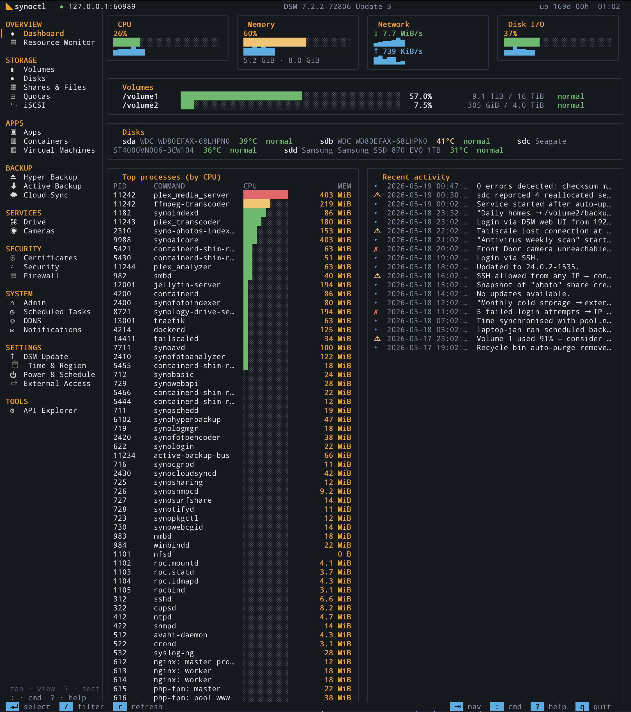

# synoctl

Terminal control room for Synology DSM.

`synoctl` auto-discovers your NAS, stores credentials in the macOS
Keychain, and gives DSM the keyboard-first interface it should have had:
storage, packages, files, backups, services, security, system state, and
raw API exploration in one fast TUI.

<p align="center">
  
</p>

## Install

```bash
brew tap janekbaraniewski/tap
brew install synoctl
```

Or grab a release tarball from the
[releases page](https://github.com/janekbaraniewski/synology-ctl/releases)
and drop the binary anywhere on `$PATH`.

## Run

```bash
synoctl
```

First run onboards automatically:

```text
mDNS / subnet sweep / Tailscale peers
  -> pick device
  -> log in
  -> credentials saved in Keychain
  -> TUI opens
```

After that, `synoctl` jumps straight into the workspace.

## What You Get

| Area | What it does |
|---|---|
| **Dashboard** | CPU, memory, network, disk I/O, volumes, disks, top processes, recent activity. |
| **Storage Health** | Logical volumes and physical disks in one hardware view with live inspector and drill-downs. |
| **Shares & Files** | Shared folder metadata, File Station tree browsing, exact `DirSize` usage, snapshots, open/download/rename/delete. |
| **Apps** | Installed packages, available catalog, and DSM services in one tabbed package surface. |
| **Backup / Services / Security** | Hyper Backup, Active Backup, Cloud Sync, Drive, Cameras, certificates, Security Advisor, Firewall. |
| **System** | Admin state, quotas, scheduled tasks, DDNS, notifications, guarded reboot/shutdown. |
| **API Explorer** | Browse `SYNO.API.Info`, fill params, call any advertised DSM endpoint, inspect JSON. |

## Design Notes

`synoctl` is intentionally not a web dashboard in terminal clothing.

- Lists stay dense and scannable.
- Inspectors preview the row under the cursor.
- Detail views are structured, not JSON dumps.
- Context keys change per view, so the footer only advertises useful actions.
- File and size operations are explicit: exact sizes come from DSM `DirSize`, downloads are written atomically, and destructive actions confirm first.

## Global Keys

| key | action |
|---|---|
| `tab` / `]` | next view |
| `shift+tab` / `[` | previous view |
| `}` / `{` | next / previous sidebar section |
| `:` | command palette |
| `/` | filter current list |
| `r` | refresh current view |
| `a` | contextual action menu |
| `i` | toggle inspector |
| `^b` | toggle sidebar |
| `?` | help |
| `q` / `^c` | quit |

## CLI

| command | what it does |
|---|---|
| `synoctl` | Launch the TUI, onboarding automatically if needed. |
| `synoctl discover` | mDNS, subnet sweep, and Tailscale peer enumeration. |
| `synoctl login` | Re-run onboarding and save/update a profile. |
| `synoctl logout` | Remove the active profile password from Keychain. |
| `synoctl apis [-f X]` | Dump `SYNO.API.Info` for the active DSM build. |
| `synoctl raw <api> <method> [-v N] [-p k=v]` | Call any DSM endpoint and print the JSON envelope. |
| `synoctl version` | Build info. |

## DSM Drift

DSM API naming and payload shapes vary across firmware generations.
The client is built to tolerate that:

- `flexBool` accepts boolean fields that arrive as `true/false` or `0/1`.
- Newer API versions are tried first, then older DSM-compatible variants.
- Common envelope drift is normalized: `packages` vs `list`, `tasks` vs `task_list`, `files` vs `items`.
- Package identifiers and display names are coalesced across DSM 7.0 and newer builds.
- Slow DSM calls get longer HTTP timeouts while individual views keep their own deadlines.

The reference device is a DS220j on DSM `7.0.1-42218`, with newer DSM
7.2.x behavior covered through demo fixtures and compatibility fallbacks.

## Development

```bash
make build
make test
make run
```

Project map:

```text
cmd/synoctl/        binary entry
internal/cli/       Cobra commands + onboarding
internal/config/    config + Keychain wrapper
internal/discover/  mDNS / subnet sweep / Tailscale discovery
internal/dsm/       typed DSM Web API client
internal/tui/       Bubble Tea shell, navigation, inspector, actions
internal/tui/views/ screens and shared widgets
```
